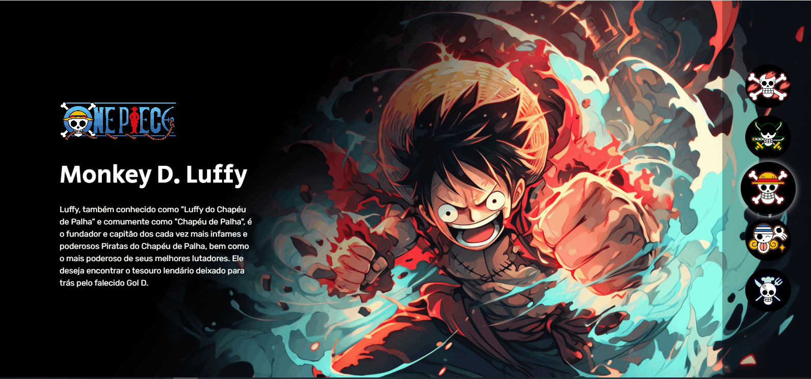

<h1 align="center">Projeto One Piece</h1> 

Projeto página de seleção de personagens da série de mangá One Piece

[]

## 🚀 Tecnologias

Esse projeto foi desenvolvido com as seguintes tecnologias:

- HTML e CSS
- JavaScript
- Git e Github

## 💻 Projeto

Nesse projeto foi construido um page de seleção de personagem da série de mangá One Piece.

- [Acesse o projeto finalizado, online](https://phtecinformatica.github.io/projeto-one-piece/).

## 📑 Licença

---

Feito por: <a href="https://www.instagram.com/phtec_informatica?igsh=ems1YmJyMzY5cnls">PHtec Informática</a>

# Projeto One Piece
